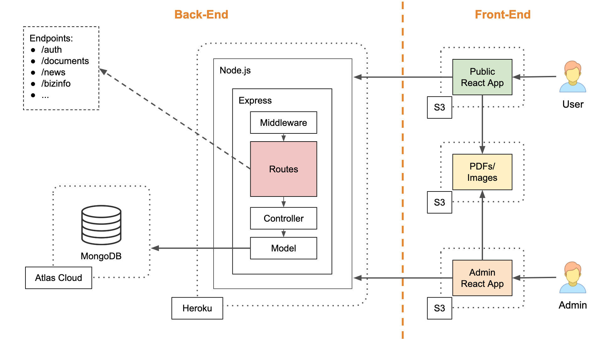

# Amazon Underwriting - Part A

## R1 - Description

Our project revolves around the **Amazon Underwriting Pty Ltd** business; they are a privately owned underwriting agency focussed on delivering insurance packages tailored for specific niche markets.

### Purpose

represent a brand on the Internet, and which is often used as the landing page for advertising content. Beyond a mere testimonial presence, a corporate website represents

The purpose of this project has **two objectives**:
1. Rebuilding from scratch the current production-live version of the [Amazon-Underwriting website](https://amazonunderwriting.com.au/) website to give it a newer/fresher design and a smoother user experience.
2. Creating a parallel web-app to be used as an admin-panel through which the business owner can autonomously manage content and media of the public website.

### Functionality 

* Database provisioning
* Collection of user contact details
* Authentication for Admin User
* Administrator panel
  * Upload of new documents
  * Deletion of old documents
  * Hide/Show of WIP documents
* Single page application
* Dynamic newsletter
* Responsive layout

### Target Audience

As previously mentioned, this project aims to provide two deliverables, with two different target audiences:
1. **Brokers**, who need support while providing insurance products and service to their clents need. An example of the final potential clients are:
   * Childcare Providers
   * Play Centre Cafes
   * Childcare Property Owners
   * Babysitters/Nanny's
   * Privates who operates a business from the home they live in
2. The **Amazon Underwriting Business Owner**, who will be using the admin panel to manage content and media of the primarely web-app

### Tech Stack

* **React**: JavaScript library used to build responsive front end interfaces and single page applications: provides tools for interfacing with a webpage DOMs. 

* **Redux**: A JavaScript library used to manage a global project state, in order to more easily access necessary data.

* **Axios**: Promise based package that simplifies the obtaining of information through asynchronous HTTP requests. 

* **NodeJS**: Javascript environment that runs JavaScript outside of the browser, allowing for backend builds that are capable of hosting web services. 

* **Express**: Web framework built on NodeJS that simplifies API backend builds by providing tools for handling client requests and responses.

* **Celebrate**: Express middleware that is used for validating information. 

* **Passport**: Authentication middleware for NodeJS, that is used to verify users. 

* **MongoDB**: Document database that stores Express API resources.

* **Mongoose**: Object data modeling library used to interface with MongoDB within NodeJS.

## R2 - Dataflow Diagram

## R3 - Application Architecture Diagram

