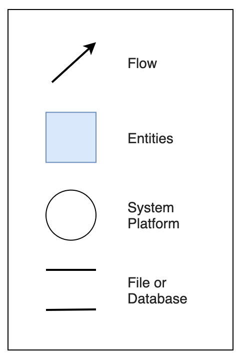
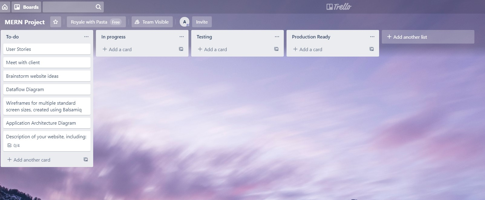
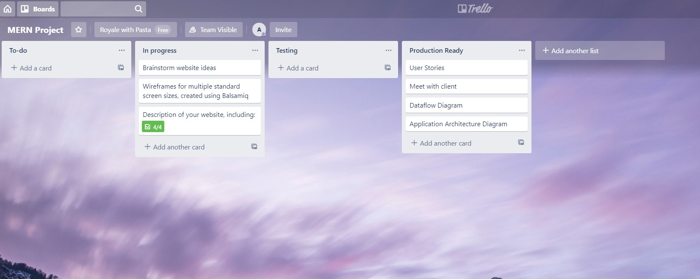
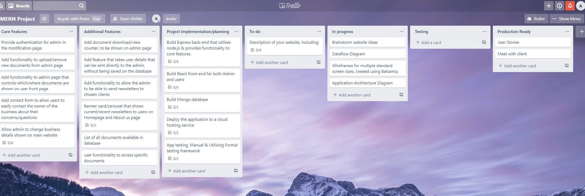

# Amazon Underwriting - Part A

## R1 - Description

Our project revolves around the **Amazon Underwriting Pty Ltd** business; they are a privately owned underwriting agency focussed on delivering insurance packages tailored for specific niche markets.

### Purpose

Create a website to be used as a landing page in order to advertise **Amazon Underwriting PTY Ltd** on the internet with a more modern UI/UX. Along with improvements to its functionality/usability with a simple to use admin-only page that gives the owner an easy way to update parts of the website they may need to update regularly.

The purpose of this project has **two objectives**:
1. Rebuilding the current production-live version of the [Amazon-Underwriting](https://amazonunderwriting.com.au/) website to give it a newer/fresher design and a smoother user experience.
2. Creating a parallel web-app to be used as an admin-panel through which the business owner can autonomously manage content and media of the public website.

### Functionality 

* Database provisioning
* Collection of user contact details
* Authentication for Admin User
* Administrator panel
  * Upload of new documents
  * Deletion of old documents
  * Hide/Show of WIP documents
* Single page application
* Dynamic newsletter
* Responsive layout

### Target Audience

As previously mentioned, this project aims to provide two deliverables, with two different target audiences:
1. **Brokers**, who need support while providing insurance products and service to their clents need. An example of the final potential clients are:
   * Childcare Providers
   * Play Centre Cafes
   * Childcare Property Owners
   * Babysitters/Nanny's
   * Privates who operates a business from the home they live in
2. The **Amazon Underwriting Business Owner**, who will be using the admin panel to manage content and media of the primarely web-app

### Tech Stack
Core technology will be the MERN stack (MongoDB, Express, React and Node.js)
* **React**: JavaScript library used to build responsive front end interfaces and single page applications: provides tools for interfacing with a webpage DOMs. 

* **Redux**: A JavaScript library used to manage a global project state, in order to more easily access necessary data.

* **Axios**: Promise based package that simplifies the obtaining of information through asynchronous HTTP requests. 

* **NodeJS**: Javascript environment that runs JavaScript outside of the browser, allowing for backend builds that are capable of hosting web services. 

* **Express**: Web framework built on NodeJS that simplifies API backend builds by providing tools for handling client requests and responses.

* **Celebrate**: Express middleware that is used for validating information. 

* **Passport**: Authentication middleware for NodeJS, that is used to verify users. 

* **MongoDB**: Document database that stores Express API resources.

* **Mongoose**: Object data modeling library used to interface with MongoDB within NodeJS.

## R2 - Dataflow Diagrams

To give a full understanding about how data flows within our project, we created two representations:
* A Page-based breakdown
* The Yourdon/DeMarco notation

### Page-based breakdown

### Yourdon/DeMarco notation
**Legend** 

**Users scenario** 

**Admin scenario** 

## R3 - Application Architecture Diagram

## R4- User Stories

| Creation Date | Change Date | User Story | Notes | Feature |
| --- | --- | --- | --- | --- |
| 13th Jan 20 |  | As an **administrator**, I want to have a private access, so that I can autonomously modify different parts of the website | |Admin Authentication |
| 16th Jan 20 |  | As an **administrator**, I want users to access a public/read-only web-app, so that they cannot modify/delete content |  | Restrict user access|
| 13th Jan 20 | 16th Jan 20 | ~~As an **administrator** I want to be able to upload/remove/hide documents to the website, so that I can make sure that those documents are relevant.~~ | Refined into 3 User Stories | 
| 16th Jan 20 |  | As an **administrator** I want to be able to upload new documents to the website, so that I can make sure that those documents are relevant. |  |  Add document upload capabilities |
| 16th Jan 20 |  | As an **administrator** I want to be able to delete old documents to the website, so that I can make sure that those documents are relevant. | Possibly add revert changes capability | Add delete functionality |
| 16th Jan 20 |  | As an **administrator** I want to be able to hide/show existing documents to the website, so that I can make sure that those documents are relevant. |  | Tickbox next to documents on admin page |
| 13th Jan 20 |  | As an **administrator** I want to be able to rearrange the position of documents on the website, so that they are grouped on relevant sections of the website. | Relevant sub-headings for documents |  |
| 13th Jan 20 |  | As the **business owner** I want to be able to collect contact information about potential clients, so that I can get in contact with them easily. | Contact form (mail chimp?) | Implement contact form |
| 13th Jan 20 | 16th Jan 20 | ~~As the **business owner** I want to be able to send out a newsletter to clients, so that I can keep them informed of changes.~~ | The client requested to descoped it | 
| 13th Jan 20 |  | As the **business owner** I want to be able to update my business details, so that information on the website stays relevant |  | Implement admin profile/business details section |
| 13th Jan 20 |  | As a **user** I want to be able to send a message from the website, so that I don’t need to go through my email client application. |  | Contact form |
| 13th Jan 20 |  | As a **user** I want an easy to understand navigation bar, so that I can navigate around the site. |  | Add navigation bar with relevant headings |
| 13th Jan 20 | 16th Jan 20 | ~~As a **user** I want to perform searches on the website, so that I can easily find relevant documents.~~ | Descoped from the project due to complexity |	

## R5 - Wireframes 

## R6 - Trello board

13/01/2020

16/01/2020

17/01/2020
